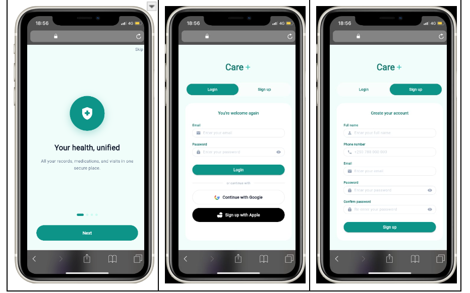
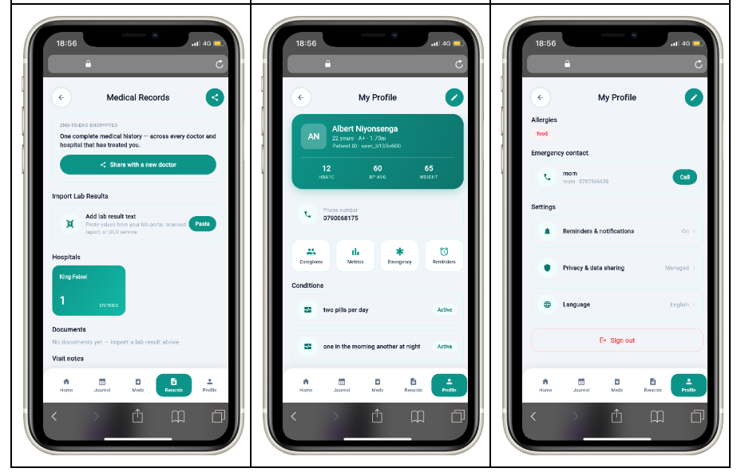
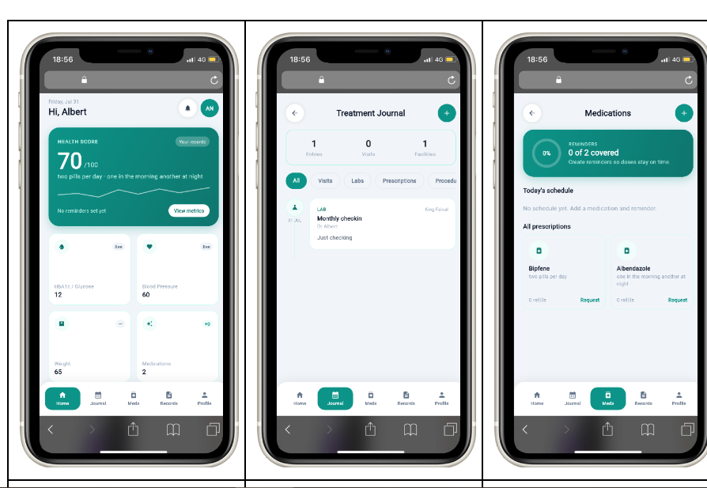

# Care+

Care+ is an offline-first mobile healthcare management application built with Flutter, Riverpod, a local Drift (SQLite) database, and Firebase. It lets a patient keep a personal health profile, track medications and reminders, log health metrics and journal entries, store medical documents, manage caregivers, and generate time-limited emergency-access codes and record-sharing tokens, all usable without a live internet connection, syncing to the cloud once one is available.

Developed by Group 3 

---

# App Demo

## [Watch App Demo](https://canva.link/z3q2vnnivtk76ix)

---

# App Screenshots

| Sign Up | Profile | Home Dashboard |
|  |  |  |

---

## Features

## Authentication
- Email/password authentication through Firebase Authentication.
- Google and Apple sign-in support.
- Email verification during registration.

## Health Profile
- Store personal health information including:
  - Blood type
  - Allergies
  - Height and weight
  - HbA1c levels
  - Blood pressure
  - Emergency contacts

## Medication Management
- Add and manage medications.
- Track medication details.
- Request refills.

## Reminders
- Create medication reminders based on:
  - Time schedules
  - Specific weekdays

## Health Metrics
- Record and monitor health trends including:
  - HbA1c
  - Blood pressure
  - Weight
  - Other health measurements

## Health Journal
- Create dated journal entries for:
  - Hospital visits
  - Laboratory results
  - Prescriptions
  - Medical procedures

## Medical Documents
- Store medical document records.
- OCR functionality is currently simulated and documented under limitations.

## Caregiver Management
- Add caregivers.
- Assign role-based access permissions.

## Emergency Access
- Generate temporary emergency access codes with controlled scope.

## Record Sharing
- Generate time-limited sharing tokens for healthcare providers.

## Offline-First Support
- All user actions are saved locally using Drift (SQLite).
- Changes are queued using an outbox synchronization system.
- Data synchronizes with Firebase Cloud Firestore once connectivity returns.

---

# System Architecture

Care+ follows an offline-first layered architecture where local storage acts as the primary source of truth.

The application separates presentation, state management, data access, local persistence, and cloud synchronization.

---

## Tech Stack

| Layer | Technology |
|---|---|
| UI / Framework | Flutter (Dart ^3.11.5) - Android, iOS, and Web |
| State management | Riverpod (`flutter_riverpod`, `Notifier`/`AsyncNotifier` API) |
| Local database | Drift (SQLite), via `drift_flutter` |
| Backend | Firebase Authentication, Cloud Firestore |
| Connectivity | `connectivity_plus` |
| Local preferences | `shared_preferences` |

---

## Project Structure

```
lib/
├── constants/          # Static app constants (e.g. journal categories)
├── data/               # Data-source abstractions (legacy — see Known Limitations)
├── database/           # Drift schema, tables, and row-to-model mappers
├── features/auth/      # Auth-specific models, providers, repository, validators
├── models/             # Core domain models (Medication, Reminder, JournalEntry, ...)
├── providers/          # Riverpod providers/notifiers — providers.dart is the live one
├── repositories/       # CareRepository (Drift-backed) plus per-entity repositories
├── screens/            # App screens (auth, onboarding, home, meds, journal, ...)
├── services/           # AuthService, error mapping, platform support checks
├── sync/               # Outbox queue + sync engine (Drift <-> Firestore)
├── widgets/            # Shared/reusable widgets
├── firebase_options.dart
└── main.dart
```
---

# Getting Started

## Prerequisites

Before running Care+, ensure you have:

- Flutter SDK (`^3.11.5` or compatible)
- Dart SDK
- Android Studio or Xcode
- Firebase project configured with:
  - Firebase Authentication
  - Cloud Firestore

---

## Installation

### 1. Clone the repository

```bash
git clone https://github.com/m-dhieu/CarePlus-Mobile-App.git

cd CarePlus-Mobile-App

```

### 2. Install dependencies

```bash
flutter pub get
```

### 3. Configure Firebase

Firebase configuration is included through:

```
lib/firebase_options.dart
firebase.json
```

The project was configured using the FlutterFire CLI.

To connect the application to another Firebase project:

```bash
flutterfire configure
```

### 4. Run the application

```bash
flutter run
```

### 5. Build release APK

```bash
flutter build apk --release
```

---

# Testing

Run tests using:

```bash
flutter test
```

The test suite includes:

- Widget and application flow tests.
- Authentication repository tests.
- Authentication validation tests.
- Offline-first synchronization tests using an in-memory Drift database.

---

# Code Quality

Run static analysis and formatting:

```bash
flutter analyze

dart format .
```

---

# Firebase Security Rules

Firestore data is organized under individual users:

```
users/{uid}
```

with related collections:

```
medications
reminders
journal_entries
documents
caregivers
profile
metric_points
share_tokens
emergency_access
```

Each user should only have access to their own data.

Example rules:

```javascript
rules_version = '2';

service cloud.firestore {
  match /databases/{database}/documents {

    match /users/{userId} {

      allow read, update, create:
        if request.auth != null &&
        request.auth.uid == userId;

      match /{subcollection}/{docId} {

        allow read, write:
          if request.auth != null &&
          request.auth.uid == userId;
      }
    }
  }
}
```

Additional documentation is available in the `docs/` folder.

---

# Future Improvements and Limitations

## Current Limitations

- Document OCR currently uses simulated output instead of a real recognition engine.
- Firestore security rules are configured in Firebase Console but are not yet committed as a `firestore.rules` file.
- Record sharing currently uses text-based tokens instead of QR-code exchange.
- Password reset screen exists but is not fully connected to the login flow.
- Only onboarding completion is currently persisted using `SharedPreferences`.

## Future Improvements

Planned improvements include:

- Real OCR-based medical document scanning.
- QR-based record sharing.
- Push notifications for medication reminders.
- Expanded local persistence for user preferences.
- Additional healthcare provider workflows.

---

# AI Assistance Used

AI tools were used to support:

- Debugging and troubleshooting implementation issues.
- Improving documentation structure and clarity.
- Reviewing architecture decisions.
- Organizing testing documentation.

All application design decisions, implementation, and integration work were completed by the development team.

---

# References

- Flutter Documentation: https://flutter.dev/docs
- Firebase Documentation: https://firebase.google.com/docs
- Riverpod Documentation: https://riverpod.dev/

---

# License

This project is licensed under the MIT License.

---

# Contributors

Developed by **Group 3**
