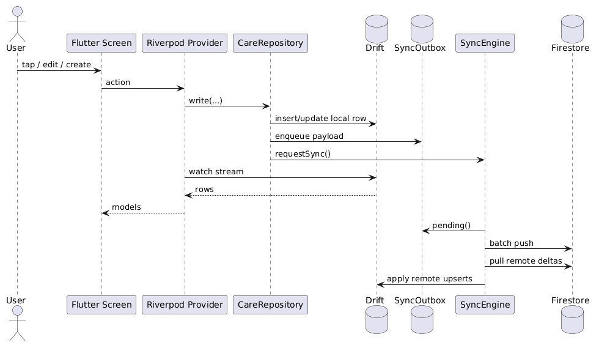
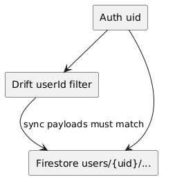
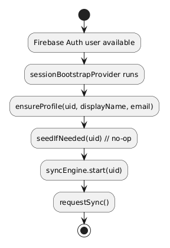
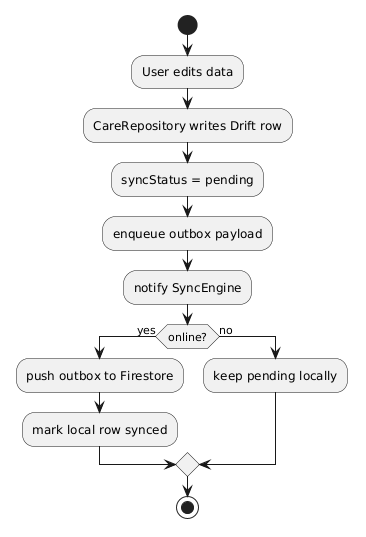

# Care+ Backend

**Audience:** Care+ mobile team  
**Firebase project:** `careplusplus-b8166`  
**This file:** single source of truth for how our backend works

Status today:

- Drift first
- Firestore background sync
- user-scoped data only
- real data only (no demo seed)
- one live path — old mock datasources / feature repos are gone

```text
providers.dart → CareRepository → Drift → Outbox → SyncEngine → Firestore
```

Screens never talk to Firestore. They read Drift through Riverpod providers.

Diagrams: `docs/backend/`.

---

## Contents

1. [One sentence model](#one-sentence-model)
2. [Why we built it this way](#why-we-built-it-this-way)
3. [High-level runtime](#high-level-runtime)
4. [Ownership model](#ownership-model)
5. [Implementation map](#implementation-map)
6. [Auth + session bootstrap](#auth--session-bootstrap)
7. [Drift local database](#1-drift-local-database)
8. [CareRepository](#2-carerepository)
9. [Outbox](#3-outbox)
10. [SyncEngine](#4-syncengine)
11. [SeedService](#5-seedservice)
12. [Providers wiring](#6-providers-wiring)
13. [Firestore layout + payloads](#firestore-layout--payloads)
14. [Security rules](#security-rules)
15. [Offline behavior](#offline-behavior)
16. [Product flows](#product-flows)
17. [Rules for future features](#rules-for-future-features)
18. [What to implement next](#what-to-implement-next)
19. [Tests](#tests)
20. [Debug checklist](#debug-checklist)
21. [Known gaps](#known-gaps)
22. [Key source files](#key-source-files)

---

## One sentence model

- write local first
- queue sync work
- push / pull in background
- keep every row owned by one signed-in user

That is the whole backend idea. Everything below is how we made that real.

---

## Why we built it this way

### Problem we were solving

Earlier the repo had multiple data stories at once:

- mock datasources for screens
- small per-feature repositories
- Firestore-shaped placeholders that were not the real write path

That made it hard to answer basic questions:

- where does a med write actually go?
- what happens offline?
- which user owns this row?

We needed one path that is fast on device, safe offline, and syncable to Firebase without putting network code in widgets.

### Decisions

| Decision | Why |
| --- | --- |
| Drift as UI source of truth | Reads stay local and streamable; UI does not wait on network |
| Outbox + SyncEngine | Reliable background push/pull without blocking the write |
| `CareRepository` as write boundary | One place owns local write + enqueue + nudge sync |
| Riverpod providers over screens | Screens stay dumb; no Firestore branching in widgets |
| Per-user Firestore paths `users/{uid}/...` | Matches Auth uid; easy owner-only rules |
| Soft delete (`deletedAt`) | Deletes can sync; no silent hard purge that desyncs devices |
| Real data only / seed no-op | No Arnold demo data mixed into production flows |
| Drop legacy mock stack | One path to reason about; less “which provider is real?” |

### What we deliberately did not build yet

- field-level conflict merge
- real-time multi-user editing of the same entity
- Cloud Functions / custom APIs beyond Auth + Firestore
- Firebase Storage upload pipeline end to end
- real OCR backend
- caregiver invite as a separate auth identity

Those are listed again under [What to implement next](#what-to-implement-next).

---

## High-level runtime

How a write moves through the app:



Step by step:

1. User taps / edits on a Flutter screen
2. Screen calls a Riverpod provider
3. Provider calls `CareRepository.write(...)`
4. Repository inserts / updates the Drift row immediately
5. Repository enqueues an outbox payload and calls `requestSync()`
6. Provider is already watching Drift → UI updates from the local stream
7. Later, `SyncEngine` reads pending outbox → batch push to Firestore → pull remote deltas → apply into Drift

Important: the UI is done after step 6. Sync is background.

---

## Ownership model

User scoping is enforced in three places. That triple rail is the main safety story.



1. Firebase Auth gives current `uid`
2. Drift queries filter by `userId`
3. Firestore paths stay under `users/{uid}/...`

Sync payloads must match path ownership. Every synced doc carries at least:

- `id`
- `userId` (= `auth.uid` / path owner)
- `updatedAt` (ISO-8601 string)

---

## Implementation map

Build order of the live stack (what each piece owns):

| Layer | Owns | File(s) |
| --- | --- | --- |
| Auth | identity + session | `lib/services/auth_service.dart`, `authProvider` |
| Session bootstrap | profile ensure + start sync | `sessionBootstrapProvider` |
| Providers | UI state + call repository | `lib/providers/providers.dart` |
| CareRepository | local write + outbox enqueue | `lib/repositories/care_repository.dart` |
| Drift | local tables + streams | `lib/database/*` |
| Outbox | pending sync queue | `lib/sync/outbox_service.dart` |
| SyncEngine | push / pull / connectivity | `lib/sync/sync_engine.dart` |
| Firestore | cross-device store | project `careplusplus-b8166` |
| Constants | collection / status / op names | `lib/sync/sync_constants.dart` |

Below: implementation by implementation.

---

## Auth + session bootstrap

### Auth service

`lib/services/auth_service.dart`

Methods:

- email / password: `signIn`, `signUp` (optional `displayName`)
- Google: `signInWithGoogle`
- Apple: `signInWithApple`
- password reset: `sendPasswordResetEmail`
- display name update: `updateDisplayName`
- sign out

Platform notes:

- Web Google: Firebase popup
- Native Google: Firebase provider first, `google_sign_in` fallback
- Apple: Firebase provider where available, native Apple plugin as fallback
- Cancelled / unavailable auth maps through `AuthErrorMapper`

### Providers on top of auth

`authProvider` (`AuthNotifier`):

- `login` / `signUp` / `register` / `sendPasswordReset`
- `signInWithGoogle` / `signInWithApple`
- `logout` — **stops SyncEngine first**, then Firebase sign-out

`register(...)` is the product sign-up path:

1. `AuthService.signUp(..., displayName:)`
2. `CareRepository.upsertProfile(uid, name, phone)`

### Session bootstrap



`sessionBootstrapProvider` runs when Auth has a user:

1. `ensureProfile(uid, displayName, email)`
2. `seedIfNeeded(uid)` — no-op in real-data mode
3. `syncEngine.start(uid)` → first `requestSync()`

If uid is null, bootstrap stops the sync engine and returns.

List / profile providers also `ref.watch(sessionBootstrapProvider)` so sync stays alive while signed in.

---

## 1) Drift local database

`lib/database/app_database.dart`  
Tables: `lib/database/tables.dart`  
Generated: `lib/database/app_database.g.dart`  
Mappers: `lib/database/mappers.dart`

### Setup

- schema version: `2`
- DB name: `careplus`
- mobile + web via `drift_flutter`
- web: `sqlite3.wasm` + `drift_worker.js`

### SyncColumns (on every entity table)

| Column | Meaning |
| --- | --- |
| `userId` | owner |
| `updatedAt` | last change |
| `syncStatus` | `pending` / `synced` / `conflict` |
| `deletedAt` | soft-delete marker (nullable) |

### Entity tables

- `medications`
- `reminders`
- `journal_entries`
- `documents`
- `caregivers`
- `user_profiles`
- `metric_points`
- `share_tokens`
- `emergency_access_codes`

### Sync tables

**`sync_outbox`**

- `id`, `userId`, `entityType`, `entityId`
- `operation` (`create` / `update` / `delete`)
- `payloadJson`
- `createdAt`, `attempts`, `lastError`

**`sync_meta`**

- composite key `(key, userId)`
- used for `lastPulledAt`, `lastPushAt`, `seeded`

### Schema v2 migration

Added when upgrading from v1:

- `user_profiles.phone`
- documents: `storagePath`, `downloadUrl`, `mimeType`, `sizeBytes`, `createdAt`
- caregivers: `status`, `invitedAt`
- share tokens + emergency: `redeemed`, `redeemedAt`

After changing tables: bump `schemaVersion`, add `onUpgrade` steps, run:

```bash
flutter pub run build_runner build --delete-conflicting-outputs
```

---

## 2) CareRepository

`lib/repositories/care_repository.dart`

This is the write boundary. Screens / providers do not write Drift or outbox themselves.

### Construction

Wired in `careRepositoryProvider` with:

- `AppDatabase`
- `OutboxService`
- `onDirty: syncEngine.requestSync`

So every successful write can nudge sync.

### Read pattern

1. watch Drift table scoped by `userId`
2. filter `deletedAt IS NULL`
3. map row → domain model (`lib/database/mappers.dart`)
4. expose `Stream<...>` to providers

### Write pattern



1. write Drift row immediately
2. set `syncStatus = pending`
3. enqueue outbox payload (latest wins per entity)
4. call `onDirty` → `requestSync()`

### Delete pattern

Soft delete:

1. set `deletedAt`
2. mark pending
3. enqueue `delete` payload (still a `set(merge: true)` on Firestore with delete fields)
4. nudge sync

### Entity coverage

| Area | Operations |
| --- | --- |
| medications | watch, add, request refill |
| reminders | watch, add, toggle, remove, update time |
| journal | watch, add |
| documents | watch, add, update OCR text, update remote metadata |
| caregivers | watch, add, remove, update role / notifications / status |
| profile | `ensureProfile`, `upsertProfile` |
| share tokens | watch, generate, revoke, mark redeemed |
| emergency | generate, revoke |
| metrics | watch series, add point |

### Write guarantees

- UI can render the new value right after the local write
- outbox holds the latest pending mutation per entity
- sync is best-effort and retried on the next cycle

---

## 3) Outbox

`lib/sync/outbox_service.dart`

### Contract

- one pending entry per `userId + entityType + entityId`
- enqueue **deletes older pending rows** for that entity first, then inserts the new one
- payload stored as JSON string
- failures bump `attempts` + `lastError` via `markAttempt`

### Ops (`SyncOps`)

- `create`
- `update`
- `delete`

### Why this shape

Quick repeated edits (toggle reminder, edit profile fields) must not grow a long queue of stale writes. Latest payload is enough.

Helpers: `pending(uid)`, `remove(id)`, `removeForEntity(...)`.

---

## 4) SyncEngine

`lib/sync/sync_engine.dart`

### Phases

`SyncPhase`: `idle` | `syncing` | `offline` | `error`  
Exposed as `syncPhaseProvider` for optional UI observation — not for switching data sources.

### Lifecycle

- `start(uid)` — subscribe connectivity, call `requestSync()`
- `stop()` — cancel debounce / connectivity, clear uid, phase → idle
- `requestSync()` — debounce ~700ms, then `syncNow()`
- `syncNow()` — if online and not already running: `_push` then `_pull`

### Push (`_push`)

1. load pending outbox for uid
2. chunk 400 (Firestore batch limit headroom)
3. for each item: `users/{uid}/{entityType}/{entityId}` → `set(payload, merge: true)`
4. on success: remove outbox row, mark local entity `synced`
5. update `lastPushAt` in `sync_meta`

Create / update / delete all use merge-set today (delete payload carries soft-delete fields).

### Pull (`_pull`)

1. read `lastPulledAt` from `sync_meta`
2. for each `EntityTypes.all` collection:
   - query `updatedAt > lastPulledAt`
   - limit 500 docs per collection per cycle
3. upsert remote docs into Drift (`insertOnConflictUpdate`)
4. `removeForEntity` matching outbox work (remote wins)
5. set local `syncStatus = synced`
6. update `lastPulledAt`

### Conflict rule (current)

- local write wins until sync runs
- on pull, remote document is applied
- matching outbox item is dropped
- practical effect: **latest remote write wins during pull**

Intentional for now: one patient session editing most of the time.

### Constants (`lib/sync/sync_constants.dart`)

`EntityTypes` collection keys (must match Firestore):

- `medications`, `reminders`, `journal_entries`, `documents`
- `caregivers`, `profile`, `metric_points`
- `share_tokens`, `emergency_access`

`SyncStatuses`: `synced` | `pending` | `conflict`  
`SyncMetaKeys`: `lastPulledAt` | `lastPushAt` | `seeded`

---

## 5) SeedService

`lib/repositories/seed_service.dart`

Kept so bootstrap wiring stays stable.  
`seedIfNeeded` is a **no-op** in real-data mode — no demo inserts.

Re-enable from git history only if you need UI demos against empty accounts.

---

## 6) Providers wiring

`lib/providers/providers.dart` is the app-facing API.

Infrastructure providers:

- `databaseProvider`
- `outboxServiceProvider`
- `syncEngineProvider`
- `seedServiceProvider`
- `careRepositoryProvider`
- `authServiceProvider` / `authStateProvider` / `currentUserIdProvider`
- `sessionBootstrapProvider`
- `syncPhaseProvider`

Feature notifiers (examples):

- `medicationsProvider`, `remindersProvider`, `journalProvider`
- `documentsProvider`, `shareTokensProvider`, `emergencyAccessProvider`
- `caregiversProvider`, `userProfileProvider`, `userProfileEditorProvider`
- `metricsProvider`
- `toastProvider`, `screenProvider`

Pattern for list notifiers:

1. watch `sessionBootstrapProvider`
2. watch repository stream for `currentUserIdProvider`
3. mutations call repository methods (never Firestore)

`toastProvider.showUnfinished(feature, detail:)` logs `[Care+][TODO] …` and shows a toast for stubs that are not shipped yet.

---

## Firestore layout + payloads

Two ID layers (seed schema + Auth):

| Layer | Example | Used for |
| --- | --- | --- |
| Firebase Auth uid | `aBcDeFg…` | Drift `userId`, nested care paths, security owner |
| Care+ public id | `user_001`, `user_003`, … | Profile `patientId`, top-level registry `users/{careUserId}` |

New signups allocate the next `user_NNN` via `meta/user_counter` (`CareUserIdService`). Offline fallback: `user_` + 8 hex chars. Sync pushes the registry doc push-only (`EntityTypes.users`, not in pull `all`).

Top-level registry (seed-shaped):

```text
users/{careUserId}          // uid, authUid, fullName, email, phone, role, status, …
meta/user_counter           // { next: N } — next public id to allocate
```

Care data stays nested under the Auth uid:

```text
users/{authUid}/medications/{id}
users/{authUid}/reminders/{id}
users/{authUid}/journal_entries/{id}
users/{authUid}/documents/{id}
users/{authUid}/caregivers/{id}
users/{authUid}/profile/{id}
users/{authUid}/metric_points/{id}
users/{authUid}/share_tokens/{id}
users/{authUid}/emergency_access/{id}
```

Collection names must match `EntityTypes`.

Profile id shape: `profile-{authUid}`. `patientId` is the Care+ public id (`user_00N`).

**Rules note:** owner-only nested paths under `users/{authUid}/…` must still allow the signed-in user to create/update their registry doc at `users/{careUserId}` when `authUid` in the payload matches `request.auth.uid`.

### Minimum payload

Every synced document:

- `id`
- `userId`
- `updatedAt`

Often also: `deletedAt` + entity business fields.

### Entity field highlights

| Collection | Key fields |
| --- | --- |
| medications | `name`, `dose`, `condition`, `refills` |
| reminders | `medicationName`, `hour`, `minute`, `days` (JSON bool list), `enabled` |
| journal_entries | `type`, `date`, `facility`, `title`, `person`, `note`, `tags`, `iconCodePoint` |
| documents | `name`, `source`, `ocrText`, optional `storagePath` / `downloadUrl` / `mimeType` / `sizeBytes` / `createdAt` |
| caregivers | `name`, `relation`, `phone`, `role`, `notificationsEnabled`, `status`, `invitedAt` |
| profile | identity + vitals, `allergies` JSON, `emergencyName` / `emergencyRelation` / `emergencyPhone` |
| metric_points | `seriesKey`, `label`, `unit`, `date`, `value` |
| share_tokens | `token`, `doctorName`, `expiresAt`, `redeemed`, `redeemedAt` |
| emergency_access | `code`, `expiresAt`, `scope`, `redeemed`, `redeemedAt` |

Indexes file: `firestore.indexes.json` (no composite indexes declared). Pull uses per-collection `updatedAt` inequality.

---

## Security rules

Policy we run with (Console / rules file when present in repo):

- signed-in users only
- owner-only access under `users/{userId}/...`
- only known collections writable
- payload must match path ownership (`id`, `userId`, `updatedAt`)

Helpers (conceptually):

- `isSignedIn()`
- `isOwner(userId)`
- `isKnownCollection(name)`
- `payloadOwnsUser(userId, docId)`

In practice:

- user A can read/write `users/A/...`
- user B cannot touch `users/A/...`
- unauthenticated access denied
- unknown / legacy top-level paths denied

### Publish (Console)

1. Firebase Console → project `careplusplus-b8166`
2. Firestore Database → Rules
3. Publish owner-only + known-collection rules
4. Rules Playground (optional):
   - Auth as A, get/set `users/{A}/medications/med-1` → allow
   - Auth as B, same path under A → deny
   - No auth → deny

`firebase.json` currently points indexes at `firestore.indexes.json`. Keep rules in sync with `EntityTypes` whenever you add a collection.

---

## Offline behavior

Local-first, not network-first.

| Situation | Behavior |
| --- | --- |
| Read | Always Drift; last synced data stays visible offline |
| Write | Succeeds locally first; sync later |
| No network | `SyncPhase.offline` |
| Network returns | `requestSync()` |
| Repeated edits | Debounced (~700ms) before sync runs |
| Delete | Soft delete + outbox; not an immediate hard purge |

App stays usable with airplane mode. Pending rows wait in outbox until push succeeds.

---

## Product flows

### Register

1. Auth screen collects full name, phone, email, password
2. `authProvider.register(...)` creates Firebase user (+ displayName)
3. Drift profile upserted with name + phone
4. Outbox queues profile create / update
5. Sync pushes under `users/{uid}/profile/profile-{uid}`

### Forgot password

- `ForgotPasswordScreen` → `sendPasswordReset(email)`
- Firebase Auth sends reset email
- no custom in-app password-change backend

### Profile edit

- Profile screen → `userProfileEditorProvider.save(...)`
- `CareRepository.upsertProfile`
- may update Firebase Auth `displayName`

### Emergency call / document open (client side)

- Call buttons: `url_launcher` `tel:` (Profile + Emergency Access)
- Document download button: opens `downloadUrl` when set; otherwise unfinished toast / `[Care+][TODO]`
- Home bell + Profile “Reminders & notifications”: navigate to Reminders (OS notification prefs still open)

These are client UX on top of the backend — they do not replace Storage upload or notification scheduling.

---

## Rules for future features

Keep these when adding work:

1. Read from Drift-backed providers — no Firestore SDK calls in screens
2. New entities land together in tables, mappers, CareRepository, SyncEngine, sync_constants
3. Syncable rows always include `userId`, `updatedAt`, soft-delete support
4. Firestore collection names stay aligned with `EntityTypes`
5. Prefer one shared data path over per-screen custom services
6. Sync status can be observed — never used to switch data sources
7. Update this file when backend behavior changes

### Checklist: new synced entity

1. Drift table in `lib/database/tables.dart` (include `SyncColumns`)
2. Bump / migrate `schemaVersion` in `app_database.dart`
3. Regenerate `app_database.g.dart`
4. Mappers in `lib/database/mappers.dart`
5. Domain model if needed in `lib/models/`
6. Watch / write methods in `CareRepository`
7. Payload builder in `CareRepository`
8. Collection key in `sync_constants.dart` (`EntityTypes`)
9. Remote apply + mark-synced handling in `SyncEngine`
10. Known collection in Firestore rules
11. Provider wiring in `providers.dart`
12. Unit / offline tests under `test/unit/`
13. Publish updated Firestore rules
14. Document the entity in this file

---

## What to implement next

Ordered by how much it blocks a complete product loop.

### Backend / sync

1. **Firebase Storage upload pipeline**  
   Write file → store `storagePath` / `downloadUrl` / mime / size on the document row → sync metadata. Open already works when `downloadUrl` is set.

2. **Real conflict policy**  
   Today: remote-last on pull. Next: decide per entity (e.g. last-writer-wins with vector/clock, or field merge for profile).

3. **Hardening SyncEngine**  
   - clearer retry / backoff using outbox `attempts`
   - surface `SyncPhase.error` in UI when useful
   - optional pull pagination beyond 500 / collection / cycle

4. **Firestore rules in repo**  
   Keep a checked-in `firestore.rules` (and wire it in `firebase.json`) so Console and git cannot drift.

5. **Caregiver invite as identity**  
   Accept invite → separate caregiver auth / scoped access — not just a row on the patient’s tree.

6. **Share / emergency redeem surface**  
   Redeemer path that is not the owning patient session (deep link / code entry + rules).

### Client features that touch backend

7. **OS local notifications** (`flutter_local_notifications` + prefs) — ReminderNotifier already stores schedules
8. **In-app notification center** — bell currently routes to Reminders
9. **Privacy & data sharing settings UI** — share-token / caregiver scopes already have data models
10. **Language / locale picker** — English-only today
11. **Real OCR** — today OCR text is manual import into the document row

### Tests / quality

12. Direct `AuthService` unit coverage
13. More SyncEngine push/pull tests with fake Firestore
14. Stronger coverage on UI-heavy screens (profile / records / emergency)

---

## Tests

Entry files:

| Entry | Covers |
| --- | --- |
| `test/unit.dart` | models, mappers, outbox, CareRepository offline path |
| `test/integration_test.dart` | signed-in shell, Drift UI flows, auth / profile wiring |
| `test/widget_test.dart` | screen smoke tests with memory Drift overrides |

Shared harness: `test/support/harness.dart`  
Layout: `test/unit/`, `test/widget/`, `test/integration/`, `test/support/`

```bash
flutter test test/unit.dart
flutter test test/integration_test.dart
flutter test test/widget_test.dart
flutter test
```

---

## Debug checklist

When data looks wrong, check in this order:

1. Is there a Firebase user?
2. Does the local Drift row have the correct `userId`?
3. Is `syncStatus` stuck at `pending` or `conflict`?
4. Does `sync_outbox` still hold the entity?
5. Is the Firestore document under `users/{uid}/{collection}/{id}`?
6. Does the payload include `id`, `userId`, `updatedAt`?
7. Do Firestore rules allow that user / path?
8. Is `SyncEngine` phase `offline` / `error`?
9. Did pull drop a local pending edit because remote won?

Grep unfinished client stubs:

```bash
rg '\[Care\+\]\[TODO\]' -n lib
```

---

## Known gaps

1. `AuthService` still has limited direct unit coverage
2. Conflict handling is remote-last apply, not field-level merge
3. Document OCR is manual text import — not a real OCR backend
4. Document open works when `downloadUrl` is set; Storage upload pipeline is not live
5. Share / emergency “redeem” is local + sync metadata — no separate redeemer auth surface
6. No Cloud Storage security rules / upload pipeline as a shipped path
7. UI-heavy screens still have thinner coverage than repository / sync
8. Rules file may live only in Console until checked into the repo again

---

## What changed from the old path

Removed:

- feature-specific mock providers
- mock / placeholder Firestore data sources
- small per-feature repositories for that stack
- demo mock data file

Why:

- no longer imported by the live app
- duplicated the real Drift / sync path
- made backend state harder to reason about

Now there is one active data path only.

---

## Key source files

```text
lib/services/auth_service.dart
lib/providers/providers.dart
lib/repositories/care_repository.dart
lib/repositories/seed_service.dart
lib/database/app_database.dart
lib/database/tables.dart
lib/database/mappers.dart
lib/models/models.dart
lib/sync/outbox_service.dart
lib/sync/sync_engine.dart
lib/sync/sync_constants.dart
firestore.indexes.json
docs/backend_docs.md          ← this file
docs/backend/*.png            ← diagrams
```

---

## Short summary

- Drift is the app-facing store
- Firestore is the cross-device store
- Firebase Auth owns identity
- `CareRepository` owns local writes
- `OutboxService` buffers sync work
- `SyncEngine` handles push / pull in the background
- every record is scoped to one authenticated user
- owner-only Firestore access on known collections
- future work is Storage, richer conflicts, caregiver identity, notifications — not a second data path

---
<div align="center">
<p> Build with ❤️</p>
</div>
